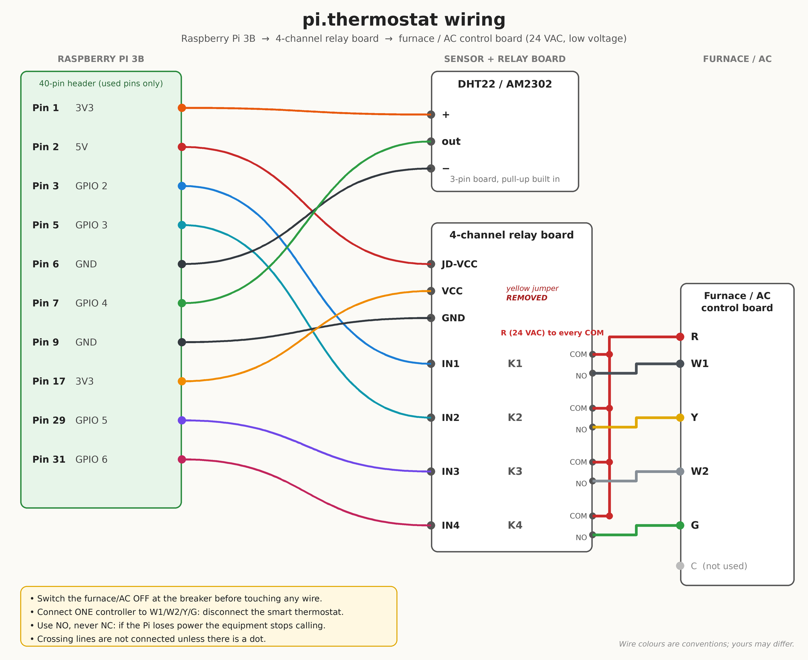
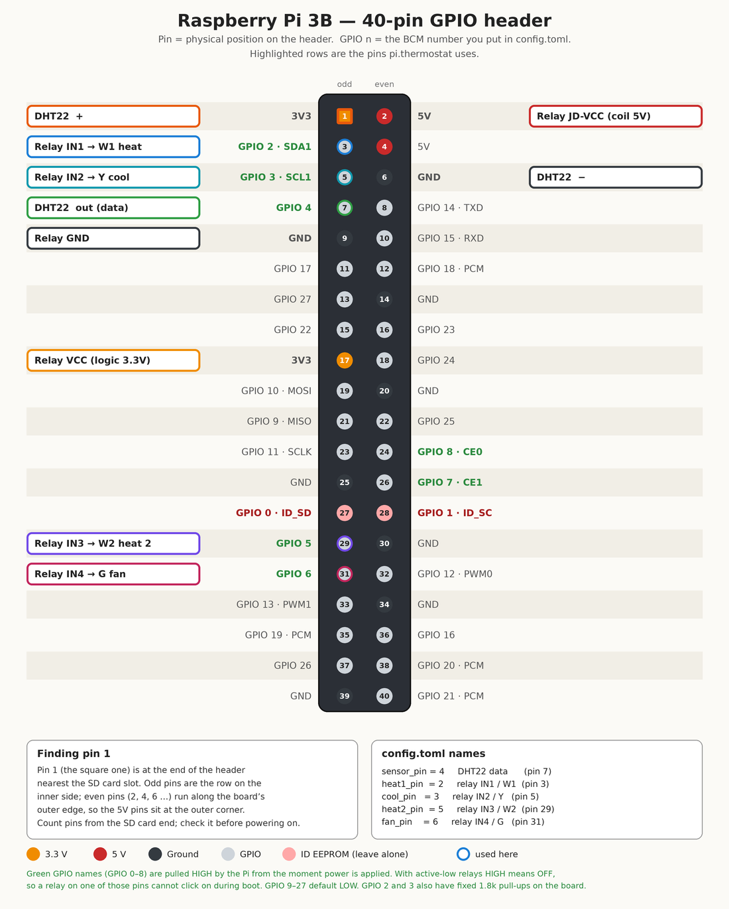

# Installing pi.thermostat on a Raspberry Pi 3B

This guide takes you from a blank SD card to a thermostat you can open on your
phone. Do the steps in order. Every check has an expected result; if something
doesn't match, go to [Troubleshooting](#troubleshooting) before continuing.

**Two safety rules before anything else**

1. The thermostat wires carry about 24 V AC. That is low voltage, but a shorted
   transformer can still fail or start a fire. **Switch the furnace/AC off at the
   breaker before you touch any wire.**
2. **Only one controller may drive W1/W2/Y/G.** This replaces your smart
   thermostat. Disconnect it (and label its wires) before connecting the relays.
   To go back, reconnect the smart thermostat the same way.

The furnace's own limit switches and safeties stay in charge. This software is
an extra layer, never the only one.

---

## 1. What you need

| Item | Notes |
|---|---|
| Raspberry Pi 3B, 2.5 A power supply, 16 GB+ microSD | The relay coils draw about 300 mA together. A weak supply causes odd resets. |
| 4-channel 5 V relay board (JQC-3FF-S-Z, as in your photo) | You already have it. |
| DHT22 / AM2302 (3-pin board) | You already have it. |
| Female-to-female jumper wires, small screwdriver | |
| Thermostat wire: R, W1, W2, Y, G (C optional) | The new 6-wire run has all of them. |
| A computer with an SD card reader | To flash the OS. |
| A host name for your home | A domain, or a dynamic-DNS name, pointing at your public IP address (section 8). Needed for the HTTPS certificate. |

## 2. Flash Raspberry Pi OS Lite

1. Install **Raspberry Pi Imager** on your computer.
2. Choose device **Raspberry Pi 3**, OS **Raspberry Pi OS Lite (32-bit)**
   (under "Raspberry Pi OS (other)"), and your SD card.
3. Click **Next → Edit settings** and set:
   * hostname: `thermostat`
   * username `pi` (or your choice) and a strong password
   * your Wi-Fi (or leave blank if you use Ethernet, which is better)
   * locale and **time zone** (for example `America/New_York`)
   * **Services → Enable SSH → Allow public-key authentication only**, paste your
     public key
4. Write the card, put it in the Pi, power on, wait two minutes.
5. From your computer: `ssh pi@thermostat.local`

Then update and install the system packages:

```bash
sudo apt update && sudo apt full-upgrade -y
sudo apt install -y python3-venv python3-dev build-essential git rsync libgpiod2 ufw
sudo reboot
```

Give the Pi a **fixed address**: in your router, reserve a DHCP lease for it
(for example `192.168.1.50`). You will need that address later.

## 3. Wire it up

Power the Pi **off** (`sudo poweroff`, then unplug) before wiring.



And the Pi's 40-pin header with every pin this project uses highlighted. Use it to
find the physical pins before you plug anything in:



(`wiring.svg` and `gpio-pinmap.svg` are the same diagrams as scalable files.)

### 3.1 Pi to sensor and relay board

| Pi physical pin | Name | Goes to |
|---|---|---|
| 1 | 3V3 | DHT22 **+** |
| 7 | GPIO 4 | DHT22 **out** |
| 6 | GND | DHT22 **−** |
| 2 | 5V | Relay board **JD-VCC** |
| 17 | 3V3 | Relay board **VCC** |
| 9 | GND | Relay board **GND** |
| 3 | GPIO 2 | Relay **IN1** (W1, heat stage 1) |
| 5 | GPIO 3 | Relay **IN2** (Y, cooling) |
| 29 | GPIO 5 | Relay **IN3** (W2, heat stage 2) |
| 31 | GPIO 6 | Relay **IN4** (G, fan) |

Want to rehearse first? [EMULATOR.md](EMULATOR.md) runs everything on a laptop.

Why these pins: GPIO 2-8 are pulled **high** by the Pi from the instant power is
applied, and your relay board is active-low (low = relay on). So every relay is
off during boot, with no software involved. This is why W2 moved from GPIO 17 to
GPIO 5.

Double-check the DHT22 plug: **+** must meet the 3.3 V wire. A reversed plug can
destroy the sensor.

### 3.2 The yellow jumper (recommended)

Your board has a yellow jumper joining the relay coil supply (JD-VCC) to the
logic supply (VCC). Remove it, and feed the two separately as in the table:
JD-VCC from **5 V**, VCC from **3.3 V**. The Pi's 3.3 V signals then match the
board's logic level exactly, so the dim LEDs go away and the relays can't sit
half-on.

Silkscreen on these boards varies. Look at the three-pin block the jumper sat
on: one pin is **JD-VCC**. If you can't tell which, check with a multimeter
(continuity) that your 5 V wire ends on the pin that connects to the relay coils'
supply, not to the header's VCC pin.

If the relays **don't click** with VCC on 3.3 V (some clone boards need more
drive current), put the jumper back and connect the header VCC to 5 V (pin 4).
That is how your old setup ran, and it worked.

### 3.3 Relay board to the furnace

Use the same terminals you used before; G is the only new one.

| Relay | Channel | COM goes to | NO goes to |
|---|---|---|---|
| K1 | IN1 | R (24 V) | **W1** |
| K2 | IN2 | R (24 V) | **Y** |
| K3 | IN3 | R (24 V) | **W2** |
| K4 | IN4 | R (24 V) | **G** |

* Use **NO** (normally open), never NC. If the Pi crashes or loses power, every
  call opens and the equipment stops.
* The red jumper wires on your board tie R to every COM. Keep that.
* **C is not used.** The Pi has its own power supply.
* Four-wire house (no G)? Skip K4 and remove `fan_pin` from the config. The Fan
  mode disappears from the app.
* No AC? Remove `cool_pin` from the config. Cool and Auto disappear.

Take a photo of the finished wiring before closing everything up.

## 4. Install the software

Power the Pi on, then:

```bash
sudo useradd --system --create-home --shell /bin/sh thermostat   # no password; see section 7
sudo usermod -aG gpio thermostat
sudo mkdir -p /opt/pi.thermostat
sudo chown thermostat:thermostat /opt/pi.thermostat
sudo -u thermostat git clone --branch <your-branch> \
     <your-repo-url> /opt/pi.thermostat
cd /opt/pi.thermostat
sudo -u thermostat python3 -m venv .venv
sudo -u thermostat .venv/bin/pip install -r requirements.txt -r requirements-pi.txt
sudo -u thermostat mkdir -p data certs
sudo chmod 700 /opt/pi.thermostat/certs
sudo -u thermostat cp config.example.toml config.toml
```

(Push the project to your repository on a branch first, or, if you have it as a
zip, unpack it into `/opt/pi.thermostat` and `chown -R thermostat:thermostat` it
instead of cloning.)

Edit `config.toml` with `sudo -u thermostat nano config.toml`:

* `[hardware]`: check the pins against section 3. Delete the `cool_pin`, `fan_pin`
  or `heat2_pin` line for equipment you don't have.
* `[control]`: set `timezone`. The other defaults are explained in section 9.
* `[server]`: `port = 8443` (any port above 1024 works without extra privileges).

**Coming from the old project?** Copy the old `db.json` to
`data/state.json`. It is converted on first start (mode and target are kept; the
old one-shot schedule is dropped). **Treat your old PIN as exposed**, because its
hash was committed to the repository: set a new one below.

Install the short `th` command, which runs the CLI as the service user:

```bash
sudo install -m 755 /opt/pi.thermostat/deploy/th /usr/local/bin/th
```

## 5. First checks (relays NOT yet connected to the furnace)

Do these with the relay board's field-side terminals **disconnected from the
furnace**, or with the furnace breaker off.

```bash
th check-config      # prints capabilities; "PIN: NOT SET" is expected for now
th test-sensor       # 10 reads
```

* `test-sensor` should report most reads succeeding (a few `fail` lines are
  normal for a DHT22). If most fail, see Troubleshooting.

```bash
th test-relays       # press Enter to click each relay for 3 seconds
```

* You should hear one relay click at a time, in this order: **W1 (K1), W2 (K3),
  Y (K2), G (K4)**. Note the order is not K1 to K4: it follows the equipment
  (heat stage 1, heat stage 2, cooling, fan). The matching IN LED lights while it
  is on. If the wrong channel responds, fix
  the wiring or swap the pin numbers in `config.toml`.

```bash
th set-pin           # type a PIN (6+ characters) twice
th get               # shows temperature, mode OFF, no faults
th proc              # one control pass; "Last run" in `th get` updates
```

Now reconnect the relay board to the furnace (breaker off while you do), switch
the breaker on, and run:

```bash
th set --mode heat --temp 75    # while the room is cooler, W1 should call within a minute
th get
th set --mode off
```

The furnace's own start-up sequence applies; the blower may take a minute to
start.

## 6. Run it all the time

### 6.1 The control loop (cron)

```bash
sudo cp deploy/crontab.example /etc/cron.d/thermostat
sudo chmod 644 /etc/cron.d/thermostat
```

It runs `init` at boot (all relays off) and `proc` every minute. Wait two
minutes, then `th get`: "Last run" should be under a minute ago.

### 6.2 The web server (systemd)

```bash
sudo cp deploy/thermostat.service /etc/systemd/system/
sudo systemctl daemon-reload
sudo systemctl enable --now thermostat
sudo systemctl status thermostat
```

The server won't start until the certificate files exist (section 7). Until
then you can try it on the LAN in development mode: in `config.toml` set
`tls = false` and `[auth] cookie_secure = false`, restart, and open
`http://thermostat.local:8443`. **Switch both back before exposing it to the
internet.**

Log: `data/thermostat.log`. Follow it with `tail -f /opt/pi.thermostat/data/thermostat.log`.

## 7. Certificate (HTTPS)

The server needs two PEM files in `/opt/pi.thermostat/certs/`:

* `fullchain.pem`: your certificate followed by the issuer's intermediate certificate(s)
* `privkey.pem`: its private key (mode 600, owned by `thermostat`)

It does not care how they get there. When either file changes it loads the new pair
within a minute, with no restart, and keeps the old one if the new pair is invalid. So
the only decision is how you obtain and renew the certificate.

**Before you start:** you need a host name that points at your home's public address (a
domain you own, or a name from a dynamic-DNS service; see section 8). Let's Encrypt
cannot issue certificates for bare IP addresses or private names such as
`thermostat.local`, and the browser will only trust a certificate that lists the exact
name you type. Throughout this section the example name is `thermostat.example.com`.

### Choose how to get the certificate

| Your situation | Use |
|---|---|
| You can forward port 80 to the Pi | **Option A**: certbot on the Pi |
| You use a DNS provider that certbot can drive through an API, and would rather not open port 80 | **Option B**: DNS challenge |
| Another machine you control already obtains certificates for this name | **Option C**: copy from that machine |
| You already have certificate files (commercial, or from your own CA) | **Option D**: place the files |

> While experimenting with options A to C, add `--staging` to the certbot command.
> Let's Encrypt limits repeated real issuance, and staging certificates are not trusted
> by browsers, so remove the flag for the real one.

### Option A: certbot on the Pi (port 80)

Let's Encrypt proves you control the name by connecting to **port 80** on it. certbot
opens that port itself, only while it checks.

```bash
sudo apt install certbot
sudo ufw allow 80/tcp        # only if you enabled the firewall in section 8
```

In your router, forward external TCP port **80** to the Pi's port 80 (alongside the
8443 forward in section 8). Then:

```bash
sudo certbot certonly --standalone -d thermostat.example.com \
     --agree-tos -m you@example.com
```

Nothing else on the Pi may be using port 80. certbot stores the certificate in
`/etc/letsencrypt/live/thermostat.example.com/`, readable only by root, so install the
hook that copies it to the thermostat after every issue or renewal:

```bash
sudo install -m 755 /opt/pi.thermostat/deploy/certbot-deploy-hook-local.sh \
     /etc/letsencrypt/renewal-hooks/deploy/thermostat.sh
sudo nano /etc/letsencrypt/renewal-hooks/deploy/thermostat.sh   # set CERT_NAME=thermostat.example.com
sudo /etc/letsencrypt/renewal-hooks/deploy/thermostat.sh        # first copy, by hand
sudo systemctl restart thermostat
```

certbot installs a timer that checks twice a day and renews a certificate once it is
close to expiry (by default 30 days before; Let's Encrypt certificates have been
getting shorter-lived, and the timer keeps up automatically). **Port 80 must stay
forwarded** for those renewals; certbot listens on it for a few seconds each time. Check the timer and rehearse a
renewal with:

```bash
systemctl list-timers | grep certbot
sudo certbot renew --dry-run
```

### Option B: DNS challenge (no open ports)

certbot proves control by adding a temporary DNS record instead, so no inbound port is
needed. You need a domain whose DNS host has an API that a certbot plugin supports
(Cloudflare, Route 53 and many others; see the certbot documentation for the full list
and each plugin's settings). Many free dynamic-DNS host names do not offer this.

Example for a provider with a plugin packaged by Debian (Cloudflare shown; replace the
package and options for your provider):

```bash
sudo apt install certbot python3-certbot-dns-cloudflare
sudo install -m 600 /dev/null /root/cloudflare.ini
sudo nano /root/cloudflare.ini            # dns_cloudflare_api_token = YOUR_TOKEN
sudo certbot certonly --dns-cloudflare \
     --dns-cloudflare-credentials /root/cloudflare.ini \
     -d thermostat.example.com --agree-tos -m you@example.com
```

Then install the same hook as in Option A (the three commands after `certbot certonly`
there). Renewals run unattended from the same certbot timer.

### Option C: copy it from another machine

If a different machine you control already gets certificates for this name (any
machine with certbot, or another ACME client), have it push the files to the Pi after
each renewal. The supplied script does this over SSH with a key that can only write
into the Pi's `certs/` folder. The certificate there must list the thermostat's host
name.

**On the issuing machine** (as root):

```bash
ssh-keygen -t ed25519 -N '' -f /root/.ssh/thermostat_deploy -C deploy
cat /root/.ssh/thermostat_deploy.pub
```

**On the Pi**, as the `thermostat` user, create `~/.ssh/authorized_keys` with one line,
replacing the key and the issuing machine's LAN address:

```
command="rrsync -wo /opt/pi.thermostat/certs",restrict,from="192.168.1.20" ssh-ed25519 AAAA... deploy
```

```bash
sudo -u thermostat mkdir -p /home/thermostat/.ssh && sudo chmod 700 /home/thermostat/.ssh
# (create authorized_keys with the line above, then)
sudo chmod 600 /home/thermostat/.ssh/authorized_keys
sudo chown -R thermostat:thermostat /home/thermostat/.ssh
```

(The account has no password, so the only way in is that key, and the `command=`
restriction means the key can run nothing but rrsync into `certs/`.)

**On the issuing machine**, install the hook and edit its three variables
(`CERT_NAME`, `PI_HOST`, `KEY`):

```bash
sudo install -m 755 deploy/certbot-deploy-hook-remote.sh \
     /etc/letsencrypt/renewal-hooks/deploy/thermostat.sh
sudo RENEWED_LINEAGE=/etc/letsencrypt/live/YOUR-CERT-NAME \
     /etc/letsencrypt/renewal-hooks/deploy/thermostat.sh      # first copy, by hand
```

If the issuing machine does not use certbot, run the same `rsync` command from
whatever hook your ACME client provides.

### Option D: certificate files you already have

Copy them into place and fix the ownership and permissions:

```bash
sudo install -o thermostat -g thermostat -m 644 fullchain.pem /opt/pi.thermostat/certs/
sudo install -o thermostat -g thermostat -m 600 privkey.pem   /opt/pi.thermostat/certs/
```

`fullchain.pem` must contain the certificate **and** the intermediate certificates, in
that order; a certificate alone makes some phones refuse the connection. To renew,
replace the two files the same way; the server reloads them by itself.

### Check it

After the first copy, restart once (`sudo systemctl restart thermostat`), then:

```bash
ls -l /opt/pi.thermostat/certs        # privkey.pem must show -rw------- thermostat thermostat
echo | openssl s_client -connect localhost:8443 -servername thermostat.example.com 2>/dev/null \
  | openssl x509 -noout -subject -dates
```

The `notAfter` date is when it expires. After every later renewal
`data/thermostat.log` records `TLS certificate reloaded`; a bad pair is logged as
`new certificate rejected, keeping the old one`.

> **Security note.** The private key lives on the Pi. Use a certificate for the
> thermostat's host name alone (for example `certbot certonly --cert-name thermostat
> -d thermostat.example.com`), not one shared with other services: a certificate that
> covers several names shares one key between all of them, so a compromise of the Pi
> would expose the key for every service on it. The app works the same either way.

## 8. Network

1. **Router, port forward:** external TCP `8443` to the Pi's reserved address,
   port `8443`. If you chose certificate Option A, also forward external TCP `80` to
   the Pi's port `80`; that is how Let's Encrypt checks (and re-checks at each renewal).
   Visitors only ever type the 8443 address.
2. **Hostname:** your host name must resolve to your home's public IP address. If your
   provider changes that address now and then, keep the name updated with your router's
   dynamic-DNS setting or a small updater such as `ddclient` on the Pi. Test from
   outside: `nslookup thermostat.example.com` on mobile data should show your current
   public address (the one a "what is my IP" site shows from home).

   **Check for CGNAT first.** If the router's WAN address differs from the address the
   "what is my IP" site shows, your provider shares one public address between
   customers and port forwarding cannot work. Ask the provider for a public (non-CGNAT)
   address, or use a tunnel or VPN instead of exposing the port.
3. **Opening it from inside your home:** many routers can't reach their own
   public address from the LAN ("hairpin NAT"). Add a local DNS override so the
   thermostat hostname resolves to the Pi's LAN address at home (a router setting,
   Pi-hole, or similar).
4. **Pi firewall:**
   ```bash
   sudo ufw default deny incoming && sudo ufw default allow outgoing
   sudo ufw allow from 192.168.1.0/24 to any port 22 proto tcp    # SSH from the LAN only
   sudo ufw allow 8443/tcp
   sudo ufw allow 80/tcp                                           # certificate Option A only
   sudo ufw enable
   ```
5. Turn on automatic security updates: `sudo apt install unattended-upgrades`
   then `sudo dpkg-reconfigure -plow unattended-upgrades`.

Open `https://your-hostname:8443` from your phone **on mobile data** (Wi-Fi off)
to confirm remote access works, and sign in.

### Add it to the phone's home screen

* **iPhone / iPad (Safari):** Share → **Add to Home Screen**.
* **Android (Chrome):** menu → **Install app** or **Add to Home screen**.

The icon is a yellow tile with a mint "72" display and red/blue arrows; the name is "Thermostat". To swap the look, run `python3 tools/make_icons.py --design 2` (or 3) on a computer and copy `static/icons/`. The login screen starts with the
number pad; tap "Use letters instead" if your secret is a passphrase.

## 9. How it behaves (defaults, all in `config.toml`)

| Setting | Default | Meaning |
|---|---|---|
| Setpoint range | 50-85 °F | Enforced by the server. |
| Deadband | 1 °F | Heat on at target−1, off at target. Cool on at target+1, off at target. |
| Auto gap | 4 °F | Heat on at target−2 and off at target−1; cool on at target+2 and off at target+1. |
| Heat stage 2 | on when 3 °F below, off within 2 °F | W1 stays on whenever W2 is on. |
| Heat min on / off | 2 min / 2 min | |
| Cool min on / off | 3 min / 5 min | Compressor protection. |
| Heat↔cool changeover | 5 min | |
| Sensor failure | 5 failed runs | All relays off and a red banner in the app. |
| Dead-man | 5 min | If the control loop goes silent while something is running, the server shuts everything off. |
| Fan | with cooling | `fan_with_heat = true` if your furnace needs G for heat. |

Timers are checked once a minute, so "2 minutes" means 2 to 3.

**OFF always acts immediately.** A power cut or reboot starts the lockout timers
again, which protects the compressor.

## 10. Everyday commands

```bash
th get                          # status
th set --mode heat --temp 70    # change now
th set --mode cool --temp 74 --start 2025-07-01T17:30    # start later
th cancel-pending
th set --mode off
th set-pin                      # change the PIN (existing logins stay valid until they expire)
```

**Back up** `data/` (state, PIN hash) and `config.toml`. **Update:**
`cd /opt/pi.thermostat && sudo -u thermostat git pull && sudo systemctl restart thermostat`.

To log everyone out: delete `data/sessions.json` and restart the service.

## Troubleshooting

| Symptom | Likely cause and fix |
|---|---|
| `th test-sensor` mostly fails | Check the three sensor wires and the plug orientation. Make sure it is on 3.3 V. Add a 4.7 kΩ resistor from data (GPIO 4) to 3.3 V. Confirm `libgpiod2` is installed. Run it again after a reboot. |
| `th test-sensor`: import error | Run `.venv/bin/pip install -r requirements-pi.txt`. If `adafruit_dht` still fails to import, try `pip install --upgrade adafruit-blinka`. |
| Wrong relay clicks | Swap pin numbers in `config.toml` (they are BCM numbers, not physical pin numbers). |
| Relays click but never release, or LEDs glow dimly | Remove the jumper and use separate 3.3 V and 5 V (section 3.2). |
| No relay responds | Active-high board? Set `relay_active_low = false`. Check JD-VCC has 5 V. |
| App says "controller hasn't reported recently" | Cron isn't running: `cat /etc/cron.d/thermostat`, `grep CRON /var/log/syslog`, or run `th -v proc`. |
| Red banner "Control loop stopped" | Same cause. The dead-man switch shut the relays off. The banner clears when cron runs again. |
| Red banner "Temperature sensor failing" | See the sensor rows. It clears itself once reads recover. |
| Server won't start: `TLS file not found` | The certificate hasn't arrived yet (section 7). |
| `certbot` fails with "Timeout during connect" or "Connection refused" | Let's Encrypt cannot reach port 80 on your name: check the router forward, the Pi firewall, that the name points at your current public IP, and that you are not behind CGNAT (section 8). |
| A renewal never arrives | `sudo certbot renew --dry-run` shows why (usually port 80 or DNS credentials). Look for `TLS certificate reloaded` in the log; check `ls -l certs/` dates. |
| The screen zooms when tapping + or − quickly | Fixed in the current version (the page now turns off double-tap zoom but still allows pinch zoom). If you still see it, reload the page; for a home-screen shortcut, close the app fully, or delete the shortcut and add it again, so the phone fetches the new files. |
| Browser says "not private" | You opened the page by IP address or a name that isn't on the certificate. Use the hostname. |
| `429 too many attempts` at login | Wait out the lockout (the message says how long). The log shows `login throttled`. |
| Can reach it from mobile data but not at home | Add the local DNS override (section 8.3). |
| Heat runs less often than you expect | Look at `data/thermostat.log` for `deferred:` lines: minimum run/off times and the changeover lockout. |
| Anything unexpected | `th get --json`, and the last lines of `data/thermostat.log`. |
